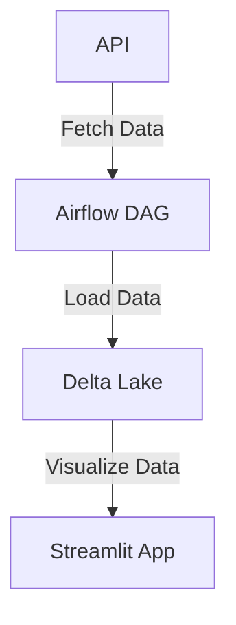

 **Electric Vehicle (EV) Population Data Pipeline**

This project is a data pipeline that fetches Electric Vehicle (EV) population data from a public API, processes it using Apache Spark, stores it in Delta Lake, and visualizes it using Streamlit. The pipeline is orchestrated using Apache Airflow.

---

## **Project Flow Diagram**



---

## **Project Overview**

1. **Fetch Data**:
   - The pipeline fetches EV population data from a public API (e.g., [Washington State EV Data](https://data.wa.gov/api/views/f6w7-q2d2/rows.json?accessType=DOWNLOAD)).

2. **Load Data**:
   - The fetched data is processed using Apache Spark and stored in Delta Lake for efficient querying and versioning.

3. **Visualize Data**:
   - A Streamlit app is used to visualize the EV population data with interactive charts and graphs.

4. **Orchestration**:
   - Apache Airflow is used to orchestrate the pipeline, ensuring that the data is fetched, processed, and visualized on a schedule.

---

## **Project Structure**

```
delta_lake_project7/
├── airflow/
│   ├── dags/                     # Airflow DAGs
│   │   └── ev_pipeline.py        # DAG for EV data pipeline
│   ├── logs/                     # Airflow logs
│   ├── plugins/                  # Airflow plugins (if any)
│   ├── Dockerfile                # Custom Dockerfile for Airflow
│   └── docker-compose.yml        # Docker Compose file for Airflow
├── scripts/
│   ├── fetch_and_load.py         # Script to fetch and load data into Delta Lake
│   └── streamlit_app.py          # Streamlit app for visualization
├── data/
│   └── delta_tables/             # Delta Lake tables
│       └── ev_population/        # EV population data stored in Delta Lake
├── requirements.txt              # Python dependencies
└── README.md                     # Project documentation
```

---

## **Setup Instructions**

### **1. Prerequisites**

- Docker and Docker Compose installed.
- Python 3.7+.

---

### **2. Clone the Repository**

```bash
git clone https://github.com/your-username/delta_lake_project7.git
cd delta_lake_project7
```

---

### **3. Build and Start the Airflow Containers**

1. Navigate to the `airflow/` folder:
   ```bash
   cd airflow
   ```

2. Build the Docker images:
   ```bash
   docker-compose build
   ```

3. Start the containers:
   ```bash
   docker-compose up
   ```

4. Access the Airflow UI at `http://localhost:8080`:
   - **Username**: `airflow`
   - **Password**: `airflow`

---

### **4. Run the Streamlit App**

1. Navigate to the `scripts/` folder:
   ```bash
   cd ../scripts
   ```

2. Install Streamlit:
   ```bash
   pip install streamlit
   ```

3. Run the Streamlit app:
   ```bash
   streamlit run streamlit_app.py
   ```

4. Access the Streamlit app at `http://localhost:8501`.

---

### **5. Trigger the Airflow DAG**

1. In the Airflow UI, enable the `ev_pipeline` DAG.
2. Trigger the DAG manually or wait for it to run based on the schedule (`@daily`).

---

## **Technologies Used**

- **Apache Airflow**: Orchestrates the data pipeline.
- **Apache Spark**: Processes the data.
- **Delta Lake**: Stores the processed data.
- **Streamlit**: Visualizes the data.
- **Docker**: Containerizes the application.

---

## **Future Enhancements**

1. Add more visualizations to the Streamlit app.
2. Integrate with a cloud storage solution (e.g., AWS S3, Azure Blob Storage).
3. Add unit tests and integration tests.

---

